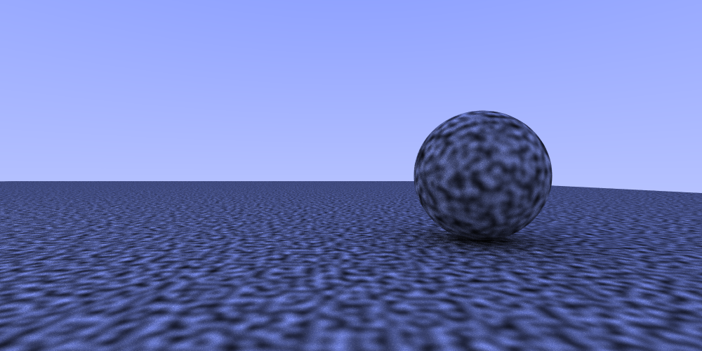

[[Traditional Chinese](README.md)] [[English](#english)]

# Wavelet Noise in Ray Tracing

This project integrates wavelet noise with ray tracing technology, providing complete research and visualization tools.

---

## English

### Project Overview
This project contains three core functional modules, covering the complete process from theoretical research to practical applications.

### Build Project
```bash
make
```

---

## Part 1: Ray Tracing Rendering

### Description
Render wavelet 3D noise texture and Perlin 3D noise texture using ray tracing techniques.

### Usage
```bash
# Build project
make

# Single result
make run

# Generate both results at once
make compare
```

### Rendering Results

| Perlin Noise Ray Tracing Result | Wavelet 3D Noise Ray Tracing Result |
|:---:|:---:|
|  |  |

---

## Part 2: Noise Experiments and Analysis

### Description
Experiments produce results close to the original paper's Figure 8, validating the band-limited characteristics of wavelet noise.

### Figure 8 Comparison

<div style="display:flex; flex-wrap:wrap; gap:20px; justify-content:center; align-items:flex-start;">
  <div style="flex:1; min-width:300px; max-width:400px; text-align:center;">
    <strong>Original Paper Figure 8</strong><br>
    
  </div>
  <div style="flex:1; min-width:300px; max-width:400px; text-align:center;">
    <strong>My Experimental Results (Comparison with Figure 8)</strong><br>
    
  </div>
</div>

### Figure 9 Comparison

<div style="display:flex; flex-wrap:wrap; gap:20px; justify-content:center; align-items:flex-start;">
  <div style="flex:1; min-width:300px; max-width:400px; text-align:center;">
    <strong>Original Paper Figure 9</strong><br>
    
  </div>
  <div style="flex:1; min-width:300px; max-width:400px; text-align:center;">
    <strong>My Experimental Results (Comparison with Figure 9)</strong><br>
    
  </div>
</div>

---

### Detailed Experimental Results (Octave 4)

#### Perlin Noise Analysis:

**Perlin 2D Noise Detailed Analysis (Octave 4)**
<div style="text-align:center; max-width:700px; margin:auto;">
  
</div>

**Perlin 3D Sliced Noise Detailed Analysis (Octave 4)**
<div style="text-align:center; max-width:700px; margin:auto;">
  
</div>

---

#### Wavelet Noise Analysis (Single frequency band results):

**Wavelet 2D Noise Detailed Analysis (Octave 4)**
<div style="text-align:center; max-width:700px; margin:auto;">
  
</div>

**Wavelet 3D Sliced Noise Detailed Analysis (Octave 4)**
<div style="text-align:center; max-width:700px; margin:auto;">
  
</div>

**Wavelet 3D Projected Noise Detailed Analysis (Octave 4)**
<div style="text-align:center; max-width:700px; margin:auto;">
  
</div>

---

#### Overall Comparison Analysis:

**Wavelet Noise Complete Comparison (Octave 4)**
<div style="text-align:center; max-width:700px; margin:auto;">
  
</div>

### Usage
```bash
# Build and run noise experiments (generate raw data)
cd experient && make && make run

# Analyze experimental results
cd experient && python3 analyze.py
```

---

## Part 3: Web Visualization

### Description
Interactive web interface for real-time observation and manipulation of noise effects.

### Usage
```bash
# Convert raw data to JSON format
cd threejs && python3 convert_raw_to_json.py --batch

# Start web server
cd threejs && python3 -m http.server 8000

# Open http://localhost:8000 in browser
```

### Web Visualization Results
*(Original version has interactive features)*

| Perlin Noise Interactive Visualization Interface | Wavelet Noise Interactive Visualization Interface |
|:---:|:---:|
|  |  | 