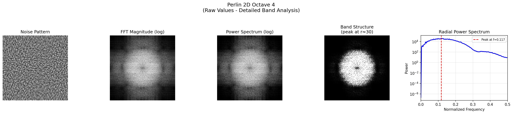
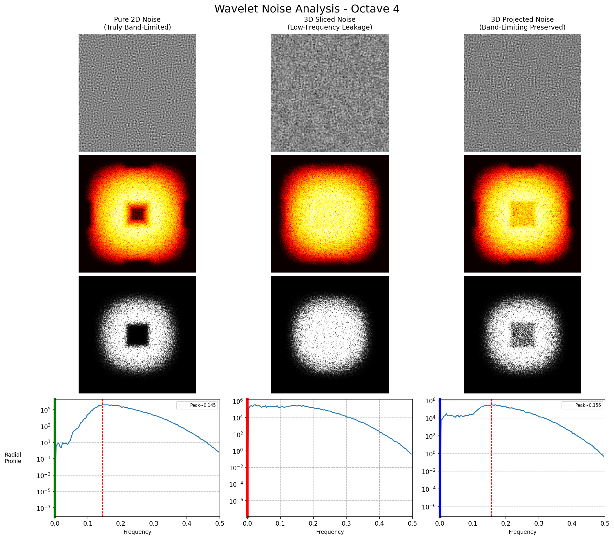
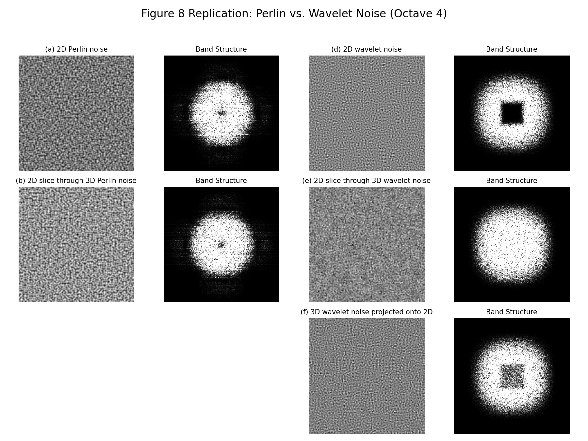

[[Traditional Chinese](README.md)] [[English](#english)]

# Wavelet Noise in Ray Tracing

This project integrates wavelet noise with ray tracing technology, providing complete research and visualization tools.

---

## English

### Project Overview
This project contains three core functional modules, covering the complete process from theoretical research to practical applications.

### Build Project
```bash
make
```

---

## Part 1: Ray Tracing Rendering

### Description
Render wavelet 3D noise texture and Perlin 3D noise texture using ray tracing techniques.

### Usage
```bash
# Build project
make

# Single result
make run

# Generate both results at once
make compare
```

### Rendering Results

| Perlin Noise Ray Tracing Result | Wavelet 3D Noise Ray Tracing Result |
|:---:|:---:|
|  |  |

---

## Part 2: Noise Experiments and Analysis

### Description
Experiments produce results close to the original paper's Figure 8, validating the band-limited characteristics of wavelet noise.

### Original Paper Reference


<table>
<tr>
<td width="250px"><strong>My Experimental Results (Octave 4)</strong></td>
<td align="center"></td>
</tr>
<tr>
<td><strong>Perlin Noise Analysis:</strong></td>
<td></td>
</tr>
<tr>
<td>Perlin 2D Noise Detailed Analysis (Octave 4)</td>
<td align="center"></td>
</tr>
<tr>
<td>Perlin 3D Sliced Noise Detailed Analysis (Octave 4)</td>
<td align="center"></td>
</tr>
<tr>
<td><strong>Wavelet Noise Analysis (Single frequency band results):</strong></td>
<td></td>
</tr>
<tr>
<td>Wavelet 2D Noise Detailed Analysis (Octave 4)</td>
<td align="center"></td>
</tr>
<tr>
<td>Wavelet 3D Sliced Noise Detailed Analysis (Octave 4)</td>
<td align="center"></td>
</tr>
<tr>
<td>Wavelet 3D Projected Noise Detailed Analysis (Octave 4)</td>
<td align="center"></td>
</tr>
<tr>
<td><strong>Overall Comparison Analysis:</strong></td>
<td></td>
</tr>
<tr>
<td>Wavelet Noise Complete Comparison (Octave 4)</td>
<td align="center"></td>
</tr>
<tr>
<td>Comparison with Original Paper Figure 8 (Octave 4)</td>
<td align="center"></td>
</tr>
</table>

### Usage
```bash
# Build and run noise experiments (generate raw data)
cd experient && make && make run

# Analyze experimental results
cd experient && python3 analyze.py
```

---

## Part 3: Web Visualization

### Description
Interactive web interface for real-time observation and manipulation of noise effects.

### Usage
```bash
# Convert raw data to JSON format
cd threejs && python3 convert_raw_to_json.py --batch

# Start web server
cd threejs && python3 -m http.server 8000

# Open http://localhost:8000 in browser
```

### Web Visualization Results
*(Original version has interactive features)*

| Perlin Noise Interactive Visualization Interface | Wavelet Noise Interactive Visualization Interface |
|:---:|:---:|
|  |  | 