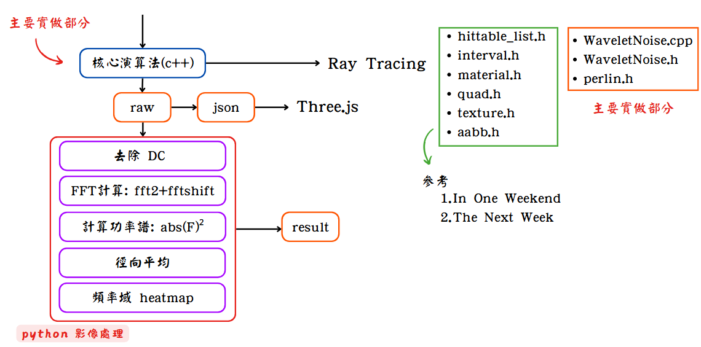
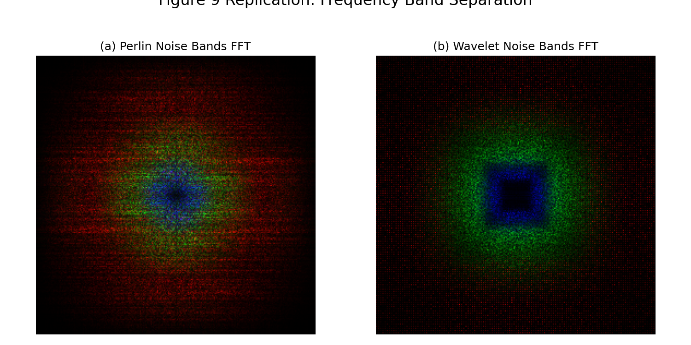

[[Traditional Chinese](#繁體中文)] [[English](README-en.md)]

# Wavelet Noise in Ray Tracing

本專案整合了小波噪聲與光線追蹤技術，提供完整的研究與可視化工具。




## 第一部分：光線追蹤渲染

### 功能說明
用 ray tracing 方式呈現 wavelet 3D noise texture 和 Perlin 3D noise texture

> 本部分的光線追蹤實作基於 [Ray Tracing in One Weekend Series](https://github.com/RayTracing/raytracing.github.io) 進行開發

### 使用方式
```bash
# 編譯專案
make

# 單一結果
make run

# 一次生成兩個結果
make compare
```

### 渲染結果展示

| Perlin Noise 光線追蹤渲染結果 | Wavelet 3D Noise 光線追蹤渲染結果 |
|:---:|:---:|
|  |  |

---

## 第二部分：噪聲實驗與分析

### 實驗說明
實驗產出接近原始論文 Figure 8 的結果，驗證 wavelet noise band-limited 的特性

### Figure 8 比較
> 註: 為甚麼我的實做沒有 white noise ? 
> 原始論文只提到他使用 FFT，但根據實驗結果，我推測論文可能有加上正規化、對比增強、閾值處理...等其他操作，並且目前還無法解釋為什麼原始論文 white noise 的頻率域會是圓的且高頻部分是黑的(應該要是低頻~高頻都有)

<table>
<tr>
<td align="center" width="50%">
<strong>原始論文 Figure 8</strong><br>

</td>
<td align="center" width="50%">
<strong>我的實驗結果 (對比 Figure 8)</strong><br>

</td>
</tr>
</table>

### Figure 9 比較

<table>
<tr>
<td align="center" width="50%">
<strong>原始論文 Figure 9</strong><br>

</td>
<td align="center" width="50%">
<strong>我的實驗結果 (對比 Figure 9)</strong><br>

</td>
</tr>
</table>

---

### 詳細實驗結果 (Octave 4)

#### Perlin Noise 分析：

* Perlin 2D Noise 詳細分析 (Octave 4) : 驗證 perlin noise 沒有 band limit 特性 

<div style="text-align:center; max-width:700px; margin:auto;">
  
</div>

* Perlin 3D Sliced Noise 詳細分析 : 驗證 perlin noise 從 3D 切出 2D 平面不具備 band-limit 特性
<div style="text-align:center; max-width:700px; margin:auto;">
  
</div>

---

#### Wavelet Noise 分析（單一頻帶）：

* Wavelet 2D Noise 分析 : 驗證 wavelet noise 有 band limit 特性    
<div style="text-align:center; max-width:700px; margin:auto;">
  
</div>

* Wavelet 3D Sliced Noise 分析 : 驗證 wavelet noise 從 3D 切出 2D 平面不具備 band-limit 特性  
<div style="text-align:center; max-width:700px; margin:auto;">
  
</div>

* Wavelet 3D Projected Noise 詳細分析 (Octave 4) : 驗證 3D project 到 2D 的 noise 具有 band-limit 特性(but not perfect)  
<div style="text-align:center; max-width:700px; margin:auto;">
  
</div>

---

#### 整體比較分析：

驗證 wavelet noise 從 3D 切出 2D 平面不具備 band-limit 特性，並且 3D project 到 2D 的 noise 具有 band-limit 特性(but not perfect)

**Wavelet Noise 完整比較 (Octave 4)**  
<div style="text-align:center; max-width:700px; margin:auto;">
  
</div>

---

### 使用方式
```bash
# 進入實驗目錄並編譯
cd experient 
make

# 執行噪聲實驗（生成 raw 數據）
make run

# 分析實驗結果
python3 analyze.py
```

---

## 第三部分：Web 可視化

### 功能說明
提供互動式 Web 介面，讓使用者能夠即時觀察和操作噪聲效果。

### 使用方式
```bash
# 轉換 raw 數據為 JSON 格式
cd threejs
python3 convert_raw_to_json.py --batch

# 啟動 Web 伺服器
python3 -m http.server 8000

# 在瀏覽器中開啟 http://localhost:8000
```

### Web 可視化結果展示

| Perlin Noise 互動式可視化介面 | Wavelet Noise 互動式可視化介面 |
|:---:|:---:|
|  |  |

---

## 參考文獻

### 光線追蹤實作參考
- [Ray Tracing in One Weekend Series](https://github.com/RayTracing/raytracing.github.io) - 光線追蹤的基礎實作與理論參考

### 相關論文
- **Wavelet Noise** - [PDF](./wavelet_noise.pdf) - 本專案實作的 Wavelet Noise 演算法理論基礎與實驗驗證參考