[[Traditional Chinese](#繁體中文)] [[English](README-en.md)]

# Wavelet Noise in Ray Tracing

本專案整合了小波噪聲與光線追蹤技術，提供完整的研究與可視化工具。

---

## 第一部分：光線追蹤渲染

### 功能說明
用 ray tracing 方式呈現 wavelet 3D noise texture 和 Perlin 3D noise texture

### 使用方式
```bash
# 編譯專案
make

# 單一結果
make run

# 一次生成兩個結果
make compare
```

### 渲染結果展示

<div style="display:flex; flex-wrap:wrap; gap:20px; justify-content:center;">
  <div style="flex:1; min-width:300px; max-width:400px; text-align:center;">
    <strong>Perlin Noise 光線追蹤渲染結果</strong><br>
    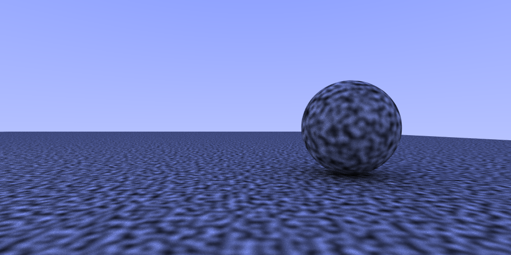
  </div>
  <div style="flex:1; min-width:300px; max-width:400px; text-align:center;">
    <strong>Wavelet 3D Noise 光線追蹤渲染結果</strong><br>
    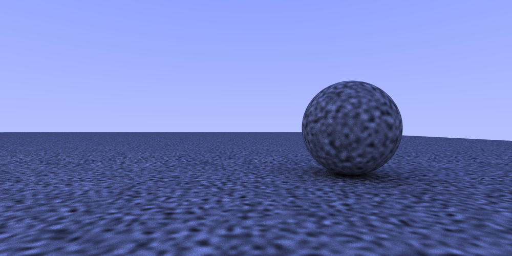
  </div>
</div>

---

## 第二部分：噪聲實驗與分析

### 功能說明
實驗產出接近原始論文 Figure 8 的結果，驗證 wavelet noise band-limited 的特性

### 原始論文參照

<div style="text-align:center; max-width:500px; margin:auto;">
  
</div>

---

### 我的實驗結果 (Octave 4)

#### Perlin Noise 分析：

**Perlin 2D Noise 詳細分析 (Octave 4)**  
<div style="text-align:center; max-width:700px; margin:auto;">
  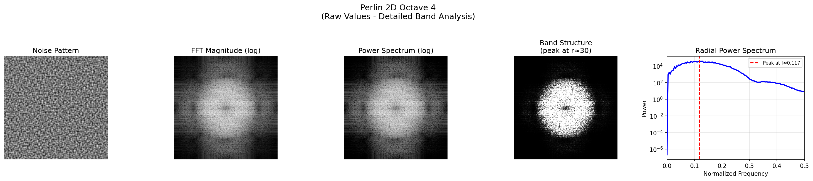
</div>

**Perlin 3D Sliced Noise 詳細分析 (Octave 4)**  
<div style="text-align:center; max-width:700px; margin:auto;">
  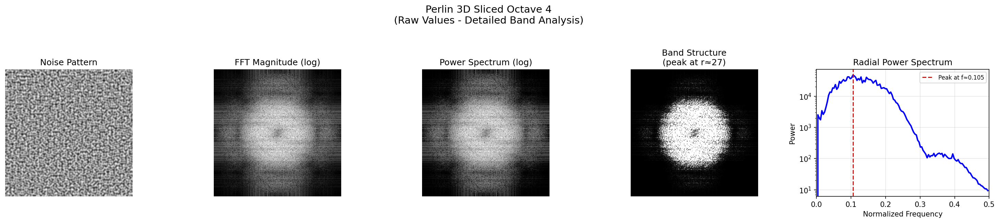
</div>

---

#### Wavelet Noise 分析（單一頻帶）：

**Wavelet 2D Noise 詳細分析 (Octave 4)**  
<div style="text-align:center; max-width:700px; margin:auto;">
  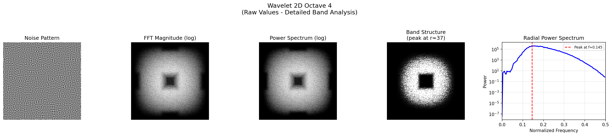
</div>

**Wavelet 3D Sliced Noise 詳細分析 (Octave 4)**  
<div style="text-align:center; max-width:700px; margin:auto;">
  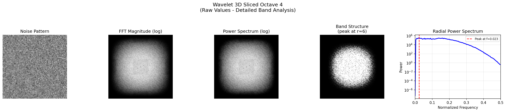
</div>

**Wavelet 3D Projected Noise 詳細分析 (Octave 4)**  
<div style="text-align:center; max-width:700px; margin:auto;">
  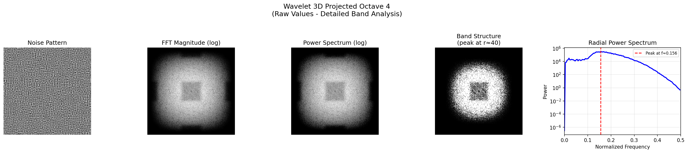
</div>

---

#### 整體比較分析：

**Wavelet Noise 完整比較 (Octave 4)**  
<div style="text-align:center; max-width:700px; margin:auto;">
  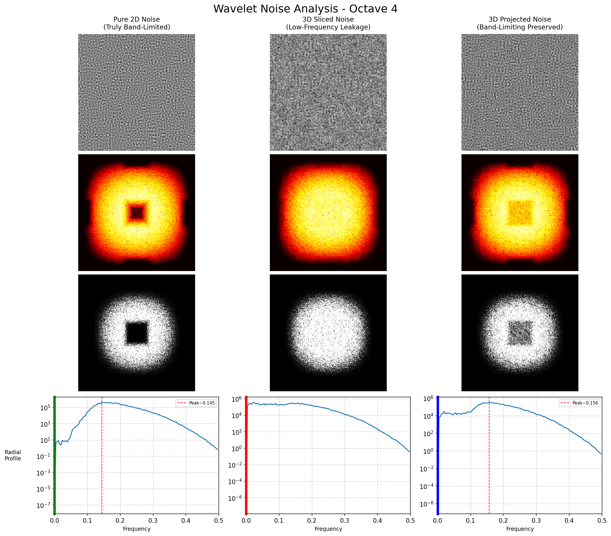
</div>

**與原始論文 Figure 8 的比較 (Octave 4)**  
<div style="text-align:center; max-width:700px; margin:auto;">
  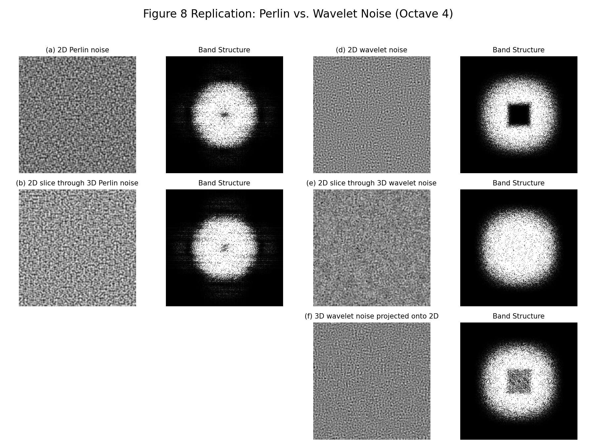
</div>

---

### 使用方式
```bash
# 進入實驗目錄並編譯
cd experient && make

# 執行噪聲實驗（生成 raw 數據）
make run

# 分析實驗結果
python3 analyze.py
```

---

## 第三部分：Web 可視化

### 功能說明
提供互動式 Web 介面，讓使用者能夠即時觀察和操作噪聲效果。

### 使用方式
```bash
# 轉換 raw 數據為 JSON 格式
cd threejs && python3 convert_raw_to_json.py --batch

# 啟動 Web 伺服器
cd threejs && python3 -m http.server 8000

# 在瀏覽器中開啟 http://localhost:8000
```

### Web 可視化結果展示  

<div style="display:flex; flex-wrap:wrap; gap:20px; justify-content:center;">
  <div style="flex:1; min-width:300px; max-width:400px; text-align:center;">
    <strong>Perlin Noise 互動式可視化介面</strong><br>
    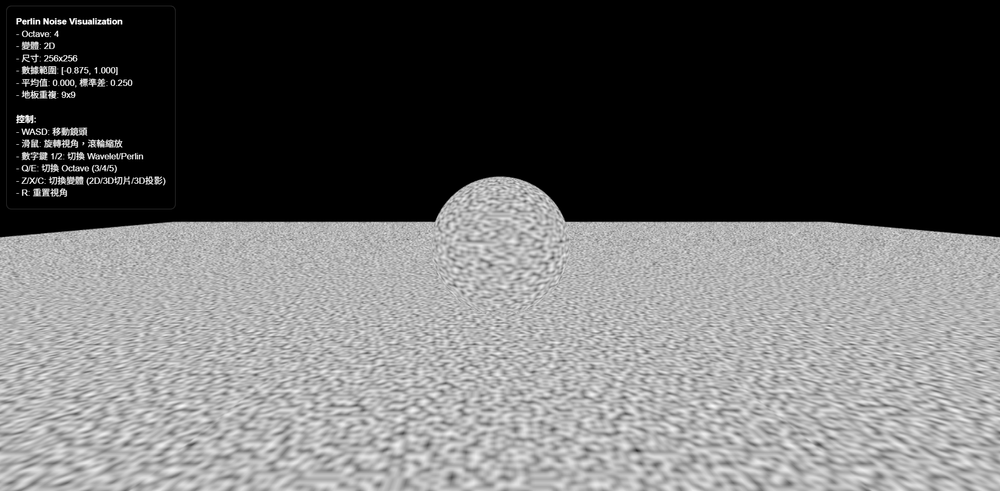
  </div>
  <div style="flex:1; min-width:300px; max-width:400px; text-align:center;">
    <strong>Wavelet Noise 互動式可視化介面</strong><br>
    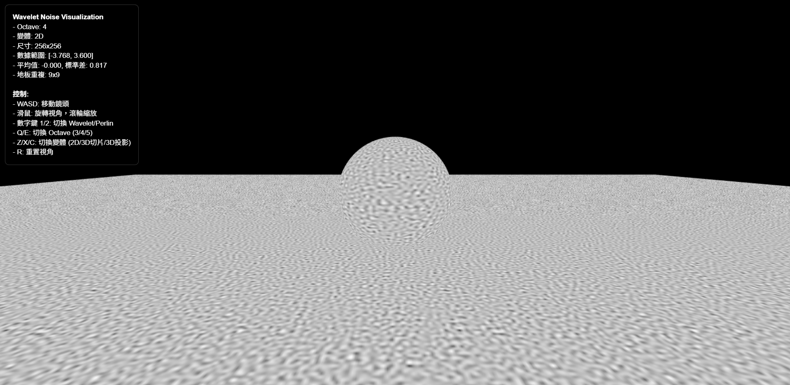
  </div>
</div>
